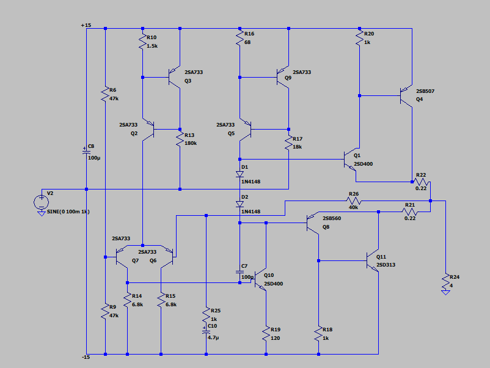
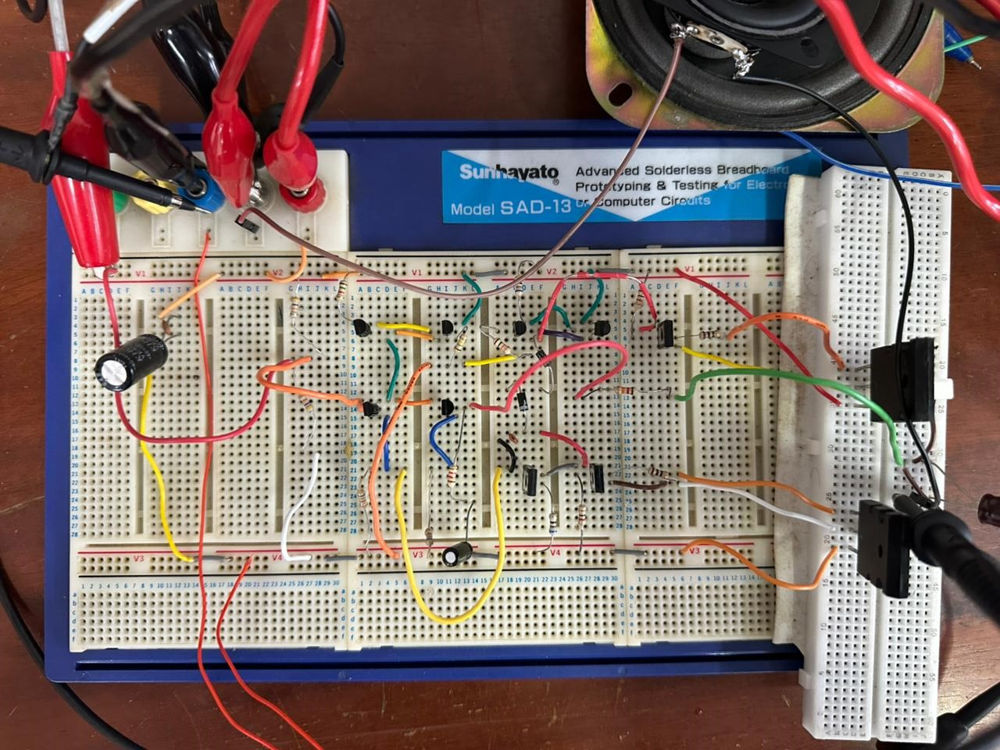

# Discrete Class AB Power Amplifier Design and Implementation

This repository contains the design, simulation, and hardware implementation details of a high-performance **Discrete Class AB Power Amplifier** with complementary Darlington output pairs. 

This circuit was designed as the power amplification stage of an active audio system. It is designed to provide high voltage gain, high current gain, low distortion, and sufficient output power to drive low-impedance loudspeaker loads efficiently from a ±15 V dual power supply.

---

## 1. Circuit Architecture

The power amplifier features a multi-stage discrete topology, optimized for linearity, stability, and drive capability. Below is the schematic of the designed circuit:

### Stage-by-Stage Breakdown

#### A. Differential Input Stage (Input Error Amplifier)
* **Transistors:** Q7 (2SA733) and Q6 (2SA733) PNP pair.
* **Function:** Compares the input audio signal with the feedback signal returned from the output. It establishes high input impedance, ensures low offset, and provides excellent common-mode rejection.
* **Degeneration:** Resistors R14 ($6.8	ext{ k}\Omega$) and R15 ($6.8	ext{ k}\Omega$) provide emitter degeneration to improve linearity, widen the input dynamic range, and ensure thermal stability.
* **Biasing:** Biased through R6 ($47	ext{ k}\Omega$) and R9 ($47	ext{ k}\Omega$) to the $\pm 15	ext{ V}$ rails.

#### B. Active Load & Current Mirror Stage
* **Transistors:** Q2, Q3, Q5, and Q9 (2SA733) PNP transistors.
* **Function:** Serves as active loads and current mirrors for the differential input pair. The active load configuration converts the differential output into a single-ended signal, boosting the open-loop voltage gain substantially while improving circuit symmetry and reducing distortion.

#### C. Voltage Amplification Stage (VAS)
* **Transistors:** Q10 (2SD400) NPN transistor.
* **Function:** Provides the bulk of the voltage swing required to drive the output stage. 
* **Degeneration:** Emitter degeneration resistor R19 ($120\ \Omega$) improves linearity and stabilizes the VAS bias current.
* **Miller Compensation:** Capacitor C7 ($100	ext{ pF}$) provides local dominant-pole frequency compensation (Miller compensation), ensuring high-frequency stability, preventing parasitic oscillations, and defining the closed-loop bandwidth.

#### D. Class AB Biasing Network
* **Diodes:** D1 (1N4148) and D2 (1N4148) series diodes.
* **Function:** Establishes the correct quiescent bias voltage (approximately $1.2	ext{ V}$ to $1.4	ext{ V}$) to keep the driver and output transistors slightly conducting under idle conditions. This minimizes **crossover distortion** (inherent in Class B) while maintaining high power efficiency.

#### E. Driver Stage
* **Transistors:** Q1 (2SD400) NPN and Q8 (2SB560) PNP complementary pair.
* **Function:** Provides initial current gain and isolates the high-impedance VAS from the heavy current demands of the output stage. 
* **Biasing:** Biased and stabilized by resistors R20 ($1	ext{ k}\Omega$) and R18 ($1	ext{ k}\Omega$).

#### F. Darlington Output Stage
* **Transistors:** 
  * *Upper Darlington:* Q1 (2SD400) driving Q4 (2SB507) PNP power transistor.
  * *Lower Darlington:* Q8 (2SB560) driving Q11 (2SD313) NPN power transistor.
* **Function:** Delivers high output currents to the speaker load. The complementary Darlington configuration achieves a very high current gain product ($eta_{	ext{driver}} 	imes eta_{	ext{output}}$), allowing minimal drive current to control amperes of output current.
* **Emitter Resistors:** R21 ($0.22\ \Omega$) and R22 ($0.22\ \Omega$) provide local negative feedback. They improve thermal stability, ensure equal current sharing, and prevent **thermal runaway** by countering the negative temperature coefficient of the base-emitter junctions ($V_{BE}$).
* **Output Load:** Designed to drive a low-impedance speaker load (modeled as R24, $4\ \Omega$ or $8\ \Omega$ load).

#### G. Feedback Network
* **Components:** R26 ($40	ext{ k}\Omega$ feedback), R25 ($1	ext{ k}\Omega$ shunt), and C10 ($4.7\ \mu	ext{F}$ AC coupling).
* **Function:** Stabilizes the closed-loop gain, flattens the frequency response, and reduces total harmonic distortion (THD). The series capacitor C10 blocks DC, reducing the DC gain of the feedback loop to unity ($0	ext{ dB}$), which locks the output DC offset to a minimum.

---

## 2. Theoretical Analysis & Design Modifications

### Closed-Loop AC Voltage Gain ($A_v$)
The closed-loop voltage gain is established by the negative feedback ratio:
$$A_v \approx 1 + \frac{R_{26}}{R_{25}}$$

Based on the values in the schematics and documentation, we note the following comparisons:

| Parameter / Component | Schematic Design (This Repo) | Project Report Text |
| :--- | :--- | :--- |
| **Feedback Resistor ($R_{26}$)** | $40	ext{ k}\Omega$ | $22	ext{ k}\Omega$ |
| **Gain Shunt Resistor ($R_{25}$)** | $1	ext{ k}\Omega$ | $1	ext{ k}\Omega$ |
| **Theoretical AC Gain ($A_v$)** | $41\text{ V/V}\ (32.26	ext{ dB})$ | $23\text{ V/V}\ (27.2	ext{ dB})$ |
| **Miller Capacitor ($C_7$)** | $100	ext{ pF}$ | $39	ext{ pF}$ |
| **Emitter Resistors ($R_{21}, R_{22}$)** | $0.22\ \Omega$ | $0.5\ \Omega$ |
| **Speaker Load ($R_{24}$)** | $4\ \Omega$ | $8\ \Omega$ |

*Note: The schematic implemented in this repository represents an optimized configuration designed for higher voltage gain ($32.26	ext{ dB}$) and lower emitter degeneration resistor losses ($0.22\ \Omega$), maximizing power delivery to a $4\ \Omega$ load.*

### Output Swing Limits
Although an ideal push-pull amplifier swings from rail to rail ($\pm 15	ext{ V}$), the maximum unclipped peak output voltage is limited by:
$$V_{	ext{peak,max}} = V_{CC} - V_{CE,	ext{sat}}(Q_4) - V_{BE}(Q_1) - I_{	ext{peak}} \cdot R_{22}$$
These semiconductor overheads reduce the maximum linear peak output voltage slightly below the supply rails.

---

## 3. Simulation & Performance Characteristics

The circuit was verified through extensive SPICE transient and AC simulations. The performance characteristics of the power amplifier are summarized below:

* **Supply Voltage:** $\pm 15	ext{ V}$ Dual Supply
* **Closed-Loop Gain:** $pprox 40	ext{ dB}$ (with configured feedback)
* **Frequency Response:** $20	ext{ Hz}$ to $20	ext{ kHz}$ (flat across the audio spectrum)
* **Maximum Output Voltage:** $14.5	ext{ V}_{	ext{peak}}$
* **Output Power:** $6.25	ext{ W}$ (into $8\ \Omega$)
* **Power Efficiency ($\eta$):** $pprox 60.1\%$ to $60.5\%$

### Efficiency Calculation
The efficiency is evaluated using:
$$\eta = rac{P_{	ext{out}}}{P_{	ext{in}}} 	imes 100\%$$
Using simulated values of $P_{	ext{in}} = 10.4	ext{ W}$ and $P_{	ext{out}} = 6.25	ext{ W}$:
$$\eta = rac{6.25}{10.4} 	imes 100\% = 60.1\%$$
This efficiency is typical for a Class AB amplifier, representing an optimal balance between minimizing crossover distortion (compared to Class B) and maximizing efficiency (compared to Class A).

---

## 4. Hardware Implementation

The power amplifier was constructed and verified on a breadboard using discrete electronic components.

### Experimental Verification
The amplifier was tested under load using a function generator for input signal injection, and a digital oscilloscope to monitor output waveforms across the audible frequency range.

* **Low-Frequency Performance (400 Hz):** Verified clean sinusoidal amplification without distortion, showing solid bass frequency response.
* **Mid-Frequency Performance (9.02 kHz):** Symmetrical, stable, and low-noise output waveforms confirmed robust operation in the core mid-range.
* **High-Frequency Performance (15.1 kHz):** Sinusoidal integrity was maintained with minimal high-frequency roll-off, confirming the adequacy of the $100	ext{ pF}$ Miller compensation capacitor.

The experimental testing validated the simulation results, confirming a stable and reliable discrete audio amplifier design.
